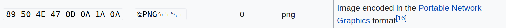
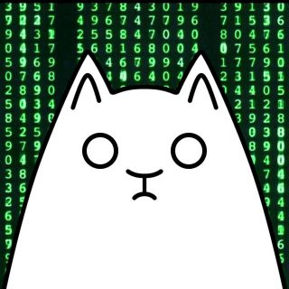

# Стеганография

## Общие понятия

Стеганография — способ передачи информации с учётом сохранения в тайне самого факта такой передачи. Информация может 
быть передана в текстах, изображениях, видео, звуковых дорожках, архивах и т.д. То, в чем передается информация, 
называют **контейнером**.

Если человек знает способ, которым информация была закодирована в контейнере, то он сможет ее извлечь. Это отличает 
стеганографию от **криптографии**, где информация шифруется, и недостаточно знать способ ее шифрования, 
чтоб расшифровать.

## Как решать таск по стеганографии

### Таск

Дан файл, содержащий набор байт. Известно, что в этом файле закодирован флаг.

### Формат данных контейнера

Сначала необходимо понять, в каком контейнере закодирована информация. Иными словами: данные какого формата содержит 
файл. Для определения формата данных можно использовать сигнатуру (magic header). Сигнатура - набор байт в начале 
файла, который содержат любые данные этого формата. Например, вот лого хакердома в формате PNG:

Если скачать картинку и открыть ее в любом hex-редакторе, то можно увидеть следующее:

Файл начинается с байтов `89 50 4E 47 0D 0A 1A 0A`, что соответствует формату PNG:

В ОС Linux для определения формата существует утилита **file**. Она также использует сигнатуры для определения
формата данных файла. В ОС Windows можно найти аналогичные программы.

Не у всех форматов есть своя сигнатура, в этом случае стоит поискать формат по определенных паттернам
в структуре: 

* повторяющиеся байты
* блоки определенного размера, дополненные нулевыми байтами в конце
* участки с монотонным возрастанием/убыванием значений байтов 

Перед тем, как переходить к поиску флага, необходимо хорошо изучить формат данных, чтобы понимать, где можно
скрыть информацию.

### Методы кодирования информации в контейнере

#### Метод больших файлов

Сообщение может быть скрыто в файле большого размера. Файл при этом может содержать как те байты, что можно 
декодировать в текст, так и те байты, которые нельзя. Для того чтобы посмотреть текстовые строки, которые могут
содержаться в таком файле, можно использовать утилиту strings. Пример использование утилиты на файле JAR:

В выводе утилиты можно видеть как "мусор", так и осмысленные строки, например `Main.classPK`,
название одного из классов Java в этой программе.

Также иногда флаг в текстовом виде можно найти в любом редакторе с помощью поиска, или используя специальные
утилиты, если файл слишком большой, чтобы открывать его в редакторе, или редактор не может его открыть.

#### Метод сокрытия в метаданных

Для сокрытия информации можно использовать метаданные формата. Для изображений в качестве метаданных
формата можно использовать [EXIF](https://ru.wikipedia.org/wiki/EXIF) заголовки. Для примера возьмем
картинку кота:

Проанализировав изображение утилитой exiftool, можно увидеть:

В EXIF заголовке comment спрятан флаг.

#### Метод отличий байтов

Кодировать информацию можно отличиями между данными. Например:

* отличие выданного в таске изображения от оригинала 
* отличие звуковых дорожек одного файла
* отличие кадров видео

Для извлечения скрытого сообщения из отличий данных в первую очередь стоит поискать оригинал для выданного файла. 
Если оригинал найти не удалось, то можно искать отличия между частями файла (дорожками, кадрами и т.п.).

Одним из простых способов найти отличия между наборами байт является побитовый XOR. При XOR-е биты с одинаковыми
значениями будут давать 0, с разными - 1. Таким образом можно понять, что получается, если из одной последовательности
байт "вычесть" другую. 

Для анализа изображений можно использовать утилиту stegsolve. Она имеет необходимый режим XOR для поиска отличий.
Пусть у нас есть два изображения:

Откроем изображения в stegsolve в режиме XOR (Analyze -> Image Combiner):

#### Метод наименее значимого бита (LSB)

Рассмотрим метод наименее значащего бита на примере с изображениями. В наиболее распространенном способе кодирования,
описанном в модели RGB, каждый пиксель представляется тремя байтами - количеством красного цвета (Red), зеленого цвета
(Green) и голубого (Blue). Поскольку каждый байт принимает значения от 0 до 255, всего можно закодировать более 16 млн 
цветов, в то время как человеческий глаз различает не более 10 млн. Поэтому, если незначительно менять значение 
байтов, представляющих пиксели, обычный человек не заметит разницы. Один из вариантов реализации такой стеганографии:
запись информации по битам в младшие биты каждого байта каждого пикселя по порядку. Такая техника называется Least
Significant Bit (LSB) - наименее значащий, то есть самый младший, бит.

Заметим, что необязательно записывать информацию в каждый байт каждого пикселя. Если контейнер достаточно большой, 
можно менять только красный канал (то есть все байты, отвечающие за количество красного цвета), можно записывать 
информацию не с начала файла, а с середины, можно менять байты только каждого третьего пикселя и так далее.
Как обнаруживать и извлекать информацию, скрытую таким образом? Можно использовать те же способы и утилиты,
что использовались в методе отличий байтов. Обнаружив отличия, можно понять, в каких байтах изменен наименее
значащий бит.

Метод LSB можно применять не только для изображений, но и для других контейнеров.

#### Метод матрешки

Когда ОС определяет тип файла для отображения пользователю, она смотрит или на расширение (Windows) или на заголовки
в начале файла (утилита file, Linux). Первый случай не такой интересный, так как если вы переименуете файл, 
сменив его расширение, то получите файл, который будет выглядеть как что-то нечитаемое и не соответствующее 
своему формату. Иными словами, будет сразу видно, что с файлом что-то не так.

Однако, если к первому файлу в конце приписать байты второго, в большинстве случаев это не нарушит целостность
первого файла и позволит знающему человеку извлечь второй. "Матрешкой" называется файл полученный при помощи 
"склеивания" произвольного числа файлов, часть из которых являются контейнерами, а часть несет скрытую информацию. 
Иногда файлы не следуют в матрешке строго друг за другом, а байты одного файла вписываются в байты другого
файла. Стоит отметить, что в данном случае может нарушиться целостность контейнера.

Такие таски можно пробовать решить утилитой binwalk. Рассмотрим изображение:

Если скачать его и передать в качестве аргумента binwalk, то увидим следующее:

Видно, что кроме изображения в файле есть и исполняемый файл elf64. Распакуем файлы, добавим файлу `11958` право
исполнения (значит, что теперь файл можно запустить), запустим:

Исполняемый файл выводит флаг.

#### Другие методы

Также в стеганографии могут использоваться другие методы сокрытия информации. В основном такие методы используют
особенности контейнеров.

Если файл считывается программой (например изображение считывается программой для просмотра изображений), то можно
подменить метаданные для изменения поведения программы. В частности, в изображении можно изменить высоту и ширину
картинки, программа прочитает изображение не полностью и часть изображения останется скрытой для человека.
В качестве примера рассмотрим изображение:

Скачаем, откроем изображение в утилите TweakPNG, изменим размер:

Сохраним изображение, получим:

В аудио можно сохранять информацию при помощи сравнения двух битов из разных дорожек. Например, если мы хотим сохранить
нулевой бит, то в обе дорожки в качестве младшего бита указать одинаковое значение, а при сохранении бита со 
значением 1 указать разные значения в дорожках.

Еще одним способом сокрытия информации в аудиофайлах является сохранение данных в осциллограмме – изображении,
показывающем мощность сигнала в зависимости от времени. Например, можно кодировать данные при помощи азбуки Морзе,
подавая долгий или короткий сигналы и делая паузы между буквами.

Анализировать аудиофайлы удобно в утилите audacity:

## Полезные

### Ссылки

* [курс от хакердома](https://www.youtube.com/playlist?list=PLU-TUGRFxOHgt6RiS-f8vVLzbk8cpqhl9)
* [список сигнатур файлов](https://en.wikipedia.org/wiki/List_of_file_signatures)
* [Steganography Lecture](https://www.youtube.com/watch?v=g5U3nsCcJk0)

### Утилиты

#### Общие

* file - определение формата данных файла
* strings (есть в репозитории linux) - извлечение тестовых строк из файла

#### Анализ изображений

* [stegsolve](http://www.caesum.com/handbook/Stegsolve.jar)
* [TweakPNG](https://www.softpedia.com/get/Multimedia/Graphic/Graphic-Others/TweakPNG.shtml#download) - под linux 
можно запускать в [wine](https://wiki.winehq.org/Download)
* [exiftool](https://exiftool.org/)

#### Анализ аудио

* [audacity](https://www.audacityteam.org/download/)

#### Анализ состава файлов

* [binwalk](https://github.com/ReFirmLabs/binwalk) - есть в репозиториях linux
