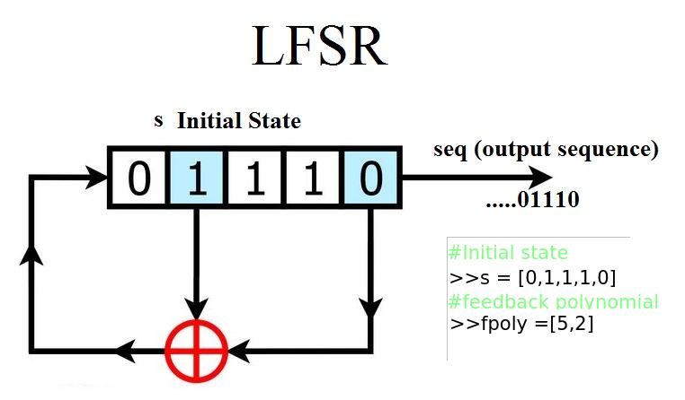

# Криптография

## Определение

Криптография - наука о методах обеспечения конфиденциальности (невозможности прочтения информации посторонним), 
целостности данных (невозможности незаметного изменения информации), аутентификации (проверки подлинности авторства 
или иных свойств объекта). Конфиденциальность обеспечивается шифрованием данных, целостность - цифровой подписью. 

## Шифрование

Пусть Алиса собирается передать сообщение Бобу. Передать сообщение она хочет через Еву, притом так, чтобы 
информацию из сообщения смог получить только Боб, но не Ева. Тогда Алиса шифрует сообщение перед передачей, а Боб 
получив сообщение, расшифровывает его. Шифрование делится на симметричное и асимметричное.

### Симметричное шифрование

При симметричном шифровании Алиса и Боб перед началом передачи сообщений обмениваются общим секретом - ключом. Так как 
Ева не имеет ключа, она не может зашифровать или расшифровать сообщение. Существует две группы симметричных шифров - 
блочные и потоковые.

#### Определения

* plaintext - исходное, незашифрованное сообщение
* ciphertext - зашифрованное сообщение

#### Шифр сдвига

Шифр сдвига - один из наиболее древних шифров. Шифрование представляет собой сдвиг каждого символа в алфавите на 
фиксированное число позиций. Например, Алиса хочет зашифровать сообщение "HACKERDOM" с помощью шифра сдвига. Для этого 
Алиса и Боб выбирают некоторое целое число, которое и будет ключом, например число 5. Алиса для каждой буквы проделывает
следующее:

* находит номер буквы в алфавите
* добавляет к номеру выбранное целое число (ключ)
* по полученному номеру находит букву в алфавите

У буквы 'H' номер 8, добавив к нему 5, получаем 13. Номер 13 у буквы 'M'. Таким образом, буква 'H' преобразуется в 'M'. 
В итоге Алиса получает слово "MFHPJWITR". Боб получая сообщение проделывает для каждой буквы обратную операцию 
(вычитает 5), получая исходное слово. Так как Ева не знает ключа, она не может расшифровать сообщение. 

Этим шифром (со сдвигом 3) пользовался римский полководец Гай Юлий Цезарь, когда передавал сообщения своим генералам. 
Поэтому за шифром сдвига также закрепилось название "шифр Цезаря".

Неизвестно, насколько эффективным шифр Цезаря был в то время, но на сегодняшний день атака на него достаточно 
тривиальна: нужно перебрать все возможные сдвиги в алфавите и посмотреть на полученные сообщения. Если символов алфавита
всего 26, как, например, в английском алфавите, то достаточно перебрать всего 26 сдвигов.

#### Шифр простой замены

Шифр простой замены - один из примеров шифров, основанных на замене символов в алфавите. Пусть Алиса хочет зашифровать
'HELLO'. Тогда Алиса и Боб составляют таблицу, где каждой букве соответствует другая буква того же алфавита.
Таблица и является ключом. 

Если каждую букву в слове 'HELLO' Алиса заменит на соответствующую по таблице букву, то получит слово 'URYYB'.

Боб также по таблице для каждой буквы может найти обратное соответствие и получить исходное слово. Ева не может 
расшифровать сообщение, так как у нее нет таблицы соответствия букв (ключа).

Если текст, зашифрованный шифром простой замены достаточно объёмный, для его вскрытия можно применить метод частотного 
анализа. Большинство текстов, написанных на естественном языке, сохраняют статистическое распределение отдельных 
символов и их последовательностей. Так, в русском языке чаще всего встречается буква "О" (10%), а в английском - "Е" 
(12%). Если посчитать частоту распределения символов в зашифрованном тексте, можно попробовать восстановить таблицу 
соответствия символов.

#### Шифр Виженера 

[Шифр Виженера](https://ru.wikipedia.org/wiki/%D0%A8%D0%B8%D1%84%D1%80_%D0%92%D0%B8%D0%B6%D0%B5%D0%BD%D0%B5%D1%80%D0%B0#%D0%9E%D0%BF%D0%B8%D1%81%D0%B0%D0%BD%D0%B8%D0%B5)
и [взлом шифра Виженера](https://ru.wikipedia.org/wiki/%D0%A8%D0%B8%D1%84%D1%80_%D0%92%D0%B8%D0%B6%D0%B5%D0%BD%D0%B5%D1%80%D0%B0#%D0%9A%D1%80%D0%B8%D0%BF%D1%82%D0%BE%D0%B0%D0%BD%D0%B0%D0%BB%D0%B8%D0%B7).

#### Блочные шифры

Блочные шифры оперируют блоками определенной длины. То есть для того, чтобы зашифровать информацию из N байт, нужно ее
разбить на блоки соответствующего размера. Если последний блок меньше, то к нему прибавляется padding. Например, в
качестве padding-a можно использовать байт, равный длине оставшегося места. При расшифровании мы можем просто посмотреть
на последний байт и понять, какой длины хвост нужно отрезать от последнего блока, чтобы получилось исходное сообщение.

#### Шифрование XOR-ом

Алиса и Боб генерируют последовательность бит, которая и является ключом. Например, ключ из 40 бит 
(5 байт): key = `0x36 0x64 0x18 0x5E 0xCB`. Алиса кодирует сообщение "hello" в байтах (ASCII): msg = `0x68 0x65 0x6C 
0x6C 0x6F`, а затем применяет операцию побитый XOR к сообщению и ключу: key ^ msg = `0x5E 0x1 0x74 0x32 0xA4`.
Боб, получая зашифрованное сообщение, XOR-ит его с ключом и получает исходное сообщение, так как XOR дважды с одной
и той же последовательностью байт приводит к исходному сообщению: key ^ msg ^ key = msg.

Одним из шифров применяющих подобный способ является [шифр Вернама](https://ru.wikipedia.org/wiki/%D0%A8%D0%B8%D1%84%D1%80_%D0%92%D0%B5%D1%80%D0%BD%D0%B0%D0%BC%D0%B0#%D0%9E%D0%BF%D0%B8%D1%81%D0%B0%D0%BD%D0%B8%D0%B5).
В этом шифре к ключам предъявляются некоторые дополнительные требования к ключу (последовательности байт) для большей
криптостойкости. 

Получить ключ при шифровании таким способом можно заполучив пару блоков (plaintext, ciphertext), то есть блок исходного
сообщения и зашифрованного. Так как plaintext = msg а ciphertext = msg ^ key, то plaintext ^ ciphertext = msg ^ msg ^
key = key. Также если длина длина ключа меньше длины сообщения, то можно использовать атаки подобные атаке на 
[шифр Виженера](#шифр-виженера). // TODO

#### Сеть Фейстеля и SPN

Существуют две популярных конструкции для построения блочных шифров. Алгоритм работы обеих конструкции
состоит из раундов. Раунд - набор повторяющихся шагов.

Первая конструкция - это сеть Фейстеля, которая стала основой алгоритма DES. Получает на вход блок текста и ключ, 
на выходе даёт блок зашифрованного текста. Алгоритм работы сети Фейстеля:

1) генерируется набор из n ключей (K0, K1, ...) 
2) блок делится на две части — левый блок L0 и правый R0
3) левый блок проходит через функцию F с ключом K0: L0 = F(L0, 
K0)
4) генерируется новый левый блок L1 = (L0 + R0) % 2
5) генерируется новый правый блок R1 = L0
6) к новым левому Ln-1 и правому Rn-1 блоку применяются шаги 2-5 n раз с использованием ключа
Kn-1

Вторая конструкция - SPN (или подстановочно-перестановочная сеть). Используется, например, в алгоритме AES. Так же, как 
и сеть Фейстеля, получает на вход блок plaintext-a и ключ. Алгоритм работы SPN:

1) генерируется набор из n ключей (K0, K1, ...)
2) plaintext делится на блоки поменьше по k бит
3) блоки проходят через S-box, он представляет собой биекцию f: 2k -> 2k, которая заменяет один 
набор битов на другой (этот этап называется слоем подстановки)
4) блоки проходят через P-box: биты меняются местами по заданной матрице перестановок
5) полученный результат XOR-ится с ключом K0
6) для вывода раунда шаги 1-4 повторяются n раз с использованием ключа Kn-1

#### AES

2 января 1997 года NIST объявили конкурс на создание преемника DES, который являлся национальным стандартом, хотя к 
тому моменту уже был взломан. Победителем конкурса стал шифр Rijndael, который позже сертифицировали и назвали AES.
Этот стандарт описывает таблицы S-box и P-box, процедуру генерации раундовых ключей из исходного и алгоритм шифрования
с использованием SPN. 

#### Потоковое шифры

Потоковый шифр - это одна из разновидностей симметричных шифров, в которой plaintext преобразуется в ciphertext в 
зависимости от вывода генератора псевдослучайной последовательности.

Самый популярный режим поточных шифров - режим гаммирования. Биты plaintext-a просто XOR-ятся с гаммой - результатом 
работы генератора. Расшифрование производится аналогично из-за свойств операции XOR.

*LFSR* (Регистр сдвига с линейной обратной связью) - разновидность таких генераторов. Значение каждого следующего 
выдаваемого им бита равно линейной функции от предыдущих значений регистров до сдвига. Принцип его работы довольно 
прост:

* читается бит из последнего регистра
* функция обратной связи по текущему состоянию регистров вычисляет новое значение x
* значения регистров сдвигаются (бит из ячейки i переносится в ячейку i+1)
* в нулевой регистр записывается x

Пример простого LFSR:

Генерируемая последовательность битов рано или поздно начнёт повторяться - это свойство называется периодичность.

LFSR подвержен атаке алгоритмом Берлекэмпа-Мэсси. При реализации в n регистров, он позволяет восстановить исходный LFSR 
за квадратичное время, имея 2n битов последовательности.

Довольно распространённый поточный шифр - RC4. Свою популярность он обрёл из-за высокой скорости работы.

Инициализация RC4 состоит из 2ух частей: инициализация S-box и генерация псевдослучайной последовательности (PRGA).
Для инициализации S-box используется KSA (key-scheduling algorithm). Сначала S-box заполняется числами от 0 до 255, 
потом в зависимости от ключа значения перемешиваются. В цикле байты ключевого потока перемешиваются и на каждой 
итерации выдаётся байт гаммы, которая в результате будет по-XOR-ена с plaintext.

RC4 уязвим к переиспользованию одного ключа, так как он будет генерировать одну и ту же гамму. Кроме того, зная 
количество итераций и состояние S-box после них, можно отмотать генератор до начального значения.

#### Режимы шифрования

Блочное шифрование может выполняться в разных режимах (mode of operation). Самый простой режим - ECB (electronic 
codebook). При таком режиме блоки шифруются независимо друг от друга:

Является самым небезопасным, так как одинаковые блоки под действием одного ключа будут давать одинаковый ciphertext.
Иногда может просматриваться структура данных в сообщении. Для примера возьмем изображение:

Зашифруем картинку в режиме ECB:

Пингвина на изображении все равно видно.

Следующий и самый популярный тип - CBC (сipher block chaining). Для этого режима кроме ключа требуется вектор 
инициализации (IV). Его не нужно держать в секрете, но нужно менять для каждого plaintext. Каждый блок XOR-ится с 
предыдущим (уже зашифрованным) блоком и только потом шифруется. Первый блок XOR-ится с вектором инициализации.
Этот режим является более безопасным.

Последний режим, который будет рассмотрен - CTR (counter). Особенностью этого режима является то, что он позволяет 
работать с блочными шифрами как с потоковыми. Генерируется nonce (аналог IV в CBC), к нему приписывается счетчик.
На каждом шаге счетчик увеличивается на 1, полученная строка шифруется и XOR-ится с plaintext.

#### Обмен ключами

Симметричная криптография подразумевает, что существует возможность обмена общим ключом по защищенному каналу, что на 
самом деле не всегда верно. Поэтому существуют протоколы выработки общего ключа при использовании незащищенного 
канала связи.

##### Протокол Диффи-Хеллмана

Предположим, что Алиса и Боб хотят выработать общий секретный ключ. Алиса и Боб по незащищенному каналу договариваются
о двух числах g и p. Алиса выбирает число a, а Боб - число b. Это их секретные ключи. Алиса вычисляет число А = 
ga (mod p)и посылает его Бобу. Боб вычисляет число B = gba = gab = K (mod p), Боб считает Ab = gab = K (mod p).
Допустим, Ева прослушивает канал. Она знает g, p, A, B. Но этой информации недостаточно для восстановления K. 
Невозможность узнать a, b по доступным ей данным, так как ей для этого нужно решить проблему дискретного 
логарифмирования.

### Асимметричное шифрование

В асимметричной (или public key) криптографии используется пара ключей - открытый (public) и закрытый (private). 
Открытый ключ используется для шифрования сообщений, закрытый - для расшифровки. 

Существуют разные алгоритмы, однако в основе любой асимметричной криптосистемы лежит односторонняя функция. Такую 
функцию легко посчитать для любого аргумента, но вычисление аргумента функции по известному значению является 
вычислительно трудной задачей. Примеры таких задач:

1) факторизация - имея составное число, требуется разложить его на множители
2) дискретный логарифм - пусть у нас есть мультипликативная группа F, для элементов этой группы g и a необходимо 
найти x в уравнении gx = a.

#### RSA

Одна из самых известных систем ассиметричного шифрования - RSA. Генерация ключей происходит следующим образом:

1) берутся два больших простых числа p и q
2) вычисляется N = p * q
3) вычисляется &#981;(N) = (p - 1)(q - 1)
4) выбирается число e взаимно простое с &#981;(N)
5) вычисляется d = e-1e % N. Для расшифровки сообщение необходимо вычислить 
cd: m = cd = (me)d = med = m1 % N. Необходимо,
чтобы m < N. Иначе нужно разбить сообщение на блоки m1,...,mk и зашифровать каждый из них 
отдельно. Последний знак равенства обосновывается теоремой Ферма.

#### Криптоанализ RSA

Существует множество неправильных реализаций RSA, которые делают систему уязвимой к атакам. Рассмотрим примеры.

Выбраны такие p и q, что их разность мала. При таких параметрах можно применить метод факторизации ферма к числу N и 
вычислить приватный ключ. Возьмем квадратный корень N и округлим его до ближайшего целого числа, обозначим его за x.
Далее в цикле по i вычисляем, является ли s = sqrt((x + i)2 - N) целым числом. Если да, то N = (x + i)
2 - s2 = (x + i + s)(x + i - s)
Чем ближе p к q, тем быстрее отработает алгоритм.

Используется одинаковое число N при различных e. Пусть у нас есть сообщение m, которое зашифровано дважды с одним 
модулем, но разными экспонентами e1 и e2 (при этом GCD(e1, e2) = 1):

* c1 = me1 % N
* c2 = me2 % N

Зная, что экспоненты взаимно просты, по расширеннной теореме Евклида можно найти такие x, y, что x * e1 + y *
e2 = 1. Тогда можно легко посчитать исходное сообщение:
cx1cy2 = (me1)x * 
(me2)y = m % N

Выбрано небольшое число e.

Атака Хастада.
Рассмотрим случай, когда е=3. Пусть имеется 3 сообщений m зашифрованных ключами (e, N1), (e, N2), 
(e, N3), m < N. Атакующий знает ci, e, Ni. Составим систему уравнений:

* c1 = m3 (mod N1)
* c2 = m3 (mod N2)
* c3 = m3 (mod N3)

По китайской теореме об остатках (CRT) существует единственное: c' = m3 (mod N1N2
N3). Вычислив кубический корень из c' атакующий может получить исходное сообщение m.

Атака Франклина-Рейтера.
Пусть имеется два различных сообщения m1, m2, зашифрованных единым ключом (e, N).
Причем m1=f(m2), f(x)=ax+b, b != 0 Атакующий знает c1, c2, f, N, e.
Составим систему уравнений:

* g1(x) = fe(x) - c1
* g2(x) = xe - c2

Заметим, что m2 является корнем как g1, так и g2. Тогда x - m2 делит оба 
многочлена. Применив алгоритм Евклида, можно найти GCD(g1, g2). Если результат окажется линейным 
многочленом (как будет, например, при e=3), то атакующий восстановит m2

## DSA

Еще один пример асимметричной криптографии - цифровые подписи, используемые для подтверждения авторства электронных 
документов.

Подпись документа производится следующим образом:

1) вычисляется хэш от документа
2) хэш зашифровывается закрытым ключом
3) зашифрованный хэш прикрепляется к документу

Процесс подтверждения (верификации) цифровой подписи:

1) извлекается зашифрованный хэш
2) хэш расшифровывается открытым ключом
3) вычисляется хэш от документа
4) расшифрованный и вычисленный хэш сравниваются

Шифровать может только обладатель закрытого ключа, а верифицировать - любой желающий, потому что открытый ключ
общедоступен. 

## Хэширование

Хэш-функция - функция, преобразующая исходную строку произвольной длины в строку установленной длины. Среди множества 
хэш-функций выделяют криптографически стойкие, то есть функции, удовлетворяющие условиям:

1) по значению хэша должно быть трудно восстановить исходные данные (необратимость)
2) при наличии сообщения M1 должно быть трудно найти сообщение M2 такое, что значения 
хэш-функции у них совпадают
3) стойкость к коллизиям - не должно быть эффективного полиномиального алгоритма, позволяющего находить разные
строки данных с одинаковым хэш-значением

Наиболее популярным семейством криптографически стойких функций является [SHA](https://en.wikipedia.org/wiki/SHA-2). 

Одним из самых ярких примеров является хранение различными сервисами хэша пароля вместо обычного текста. В таком случае
злоумышленник, получивший доступ к базе данных, не сможет получить сами пароли.

Еще один пример - применение контрольных сумм при передаче сообщений по сети. Вычисляется хэш от данных, далее 
хэш-значение передается вместе с самим сообщением. Получатель может также посчитать хэш от данных и проверить со 
значением, вычисленным отправителем, проверив таким образом корректность данных.

Хэш-функции также используются в цифровой подписи - гарантии, что документ составил определенный человек и никто не 
изменил данные при передаче. Чтобы составить электронную подпись, необходимо вычислить хэш от содержимого документа, 
зашифровать получившиеся значение с помощью приватного ключа и прикрепить к документу при передаче. 
Зная публичный ключ, получатель сможет расшифровать подпись и проверить данные.

## Полезные программы/библиотеки:

* [pycrypto](https://pypi.org/project/pycrypto/)
* [pycryptodome](https://pypi.org/project/pycryptodome/) (форк pycrypto)
* [gmpy2](https://pypi.org/project/gmpy2/)
* [sage](https://www.sagemath.org/)
* [HashPump](https://github.com/bwall/HashPump)
