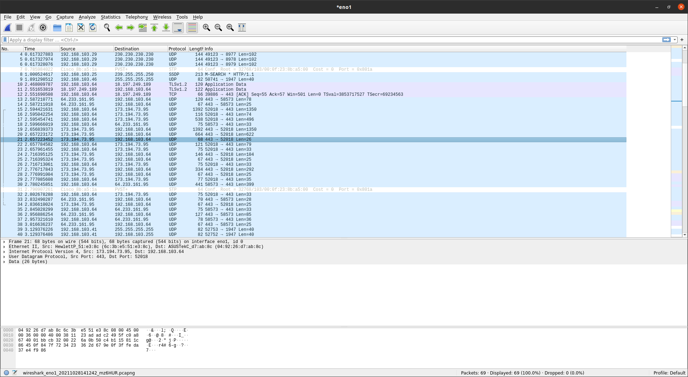
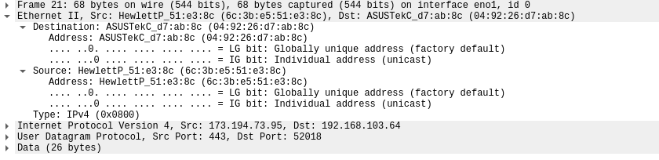
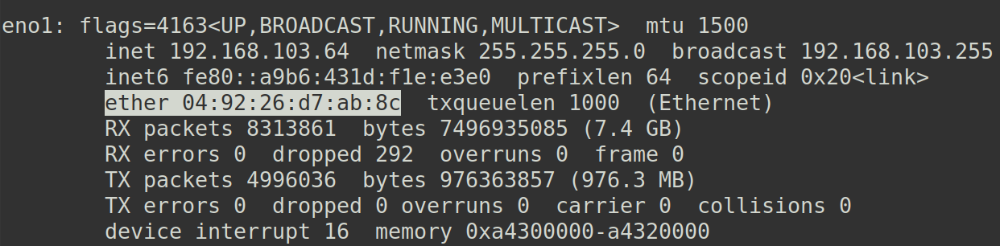
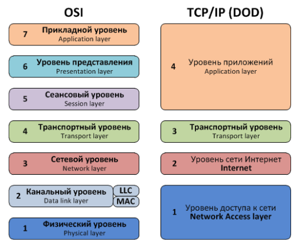

# Компьютерные сети

## Введение

Компьютерная сеть - это система, позволяющая устройствам обмениваться информацией. Например, ПК, на котором открыт 
браузер, и сервер, на котором находится сайт. Рассмотрим сеть из двух устройств - двух компьютеров. Сначала 
компьютерам, чтобы между ними образовалась связь, необходимо передавать физические сигналы. Есть различные способов
передачи сигнала:

  * медный кабель
  * радиоволны (WiFi)
  * оптоволокно
  * и т.п.

Для того чтобы компьютер, принимающий физический сигнал, смог преобразовать его в ноль или единицу (или их 
последовательность), необходим стандарт. Стандарт описывает как преобразовать физические сигналы в последовательность
бит. Для каждого из способов передачи сигнала существуют общепринятые стандарты. 

Чтобы передать информацию от одного компьютера к другому, ее необходимо закодировать - перевести в байты. Существует
большое количество методов кодирования информации. Для описания метода кодирования информации в компьютерных сетях
также используют стандарт, называемый протоколом. На данный момент наиболее популярным протоколом является Ethernet.
Согласно Ethernet устройства обмениваются друг с другом сообщениями (пакетами). Рассмотрим Ethernet пакет:

Он состоит из:

  * преамбулы - семи байт служащих для разделения пакетов и синхронизации устройств
  * SFD (start frame delimiter) - байта, отделяющего преамбулу от фрейма
  * остальной информации - фрейма Ethernet

Ethernet фрейм имеет следующий формат:

  * destination MAC address - 6 байтовый идентификатор получателя фрейма
  * source MAC address - 6 байтовый идентификатор отправителя фрейма
  * payload - данные передаваемые фреймом (сообщением)
  * CRC checksum - контрольная сумма для проверки целостности пакета

Идентификаторы (MAC адреса) нужны для того, чтобы адресовать сообщение определенному устройству в сети.

## Сетевые уровни

Взаимодейтсвие устройств на уровне физических сигналов называют физическим уровнем. Взаимодействие на уровне Ethernet
пакетов - канальным уровнем. Данные передаваемые Ethernet пакетами также закодированы согласно определенному формату
(протоколу) - IP. Согласно IP протоколу устройства также обмениваются сообщениями (пакетами). У IP пакета тоже есть
данные, которые он передает, и кодирование этих данных снова определяется протоколом. Взаимодействие на уровне IP
пакетов называют сетевым уровнем.

Таким образом выстраивается стек уровней (если взять протоколы каждого уровня, то стек протоколов): физический, 
канальный, сетевой. На каждом уровне, начиная с канального, информация кодируется в виде пакетов (сообщений). 
А содержимое этих пакетов кодируется согласно следующему протоколу - протоколу следующего уровня. Так можно выстроить 
стек уровней любого размера, где каждое следующее сообщение (пакет) является содержимым предыдущего сообщения.

Исследуем Ethernet пакет. Для исследования нам понадобится утилита [wireshark](https://www.wireshark.org/). Более 
подробно про wireshark [тут](https://habr.com/ru/post/204274/). С помощью wireshark посмотрим на сетевой трафик:

Каждая строка соответствует пакету какого-либо уровня. Выделена строка с номером 21, эта строка также 
соответствует пакету. Во втором снизу окне видно уровни, на которых можно исследовать данный пакет. Нас интересует
канальный уровень, поэтому раскроем вкладку Ethernet II:

Можно увидеть MAC адрес получателя (destination): `04:92:26:d7:ab:8c`, а также отправителя (source): 
`6c:3b:e5:51:e3:8c`. Байты MAC адреса выводятся в шестнадцетиричном представлении, разделенные двоеточием. В данном
случае MAC адрес получателя соответствует MAC адресу моего компьютера:

## Сетевые модели

Количество сетевых уровней и их виды строго регламентированы, для того чтобы устройства сети могли правильно 
раскодировать передаваемую информацию. Есть две сетевых модели: OSI и TCP/IP. Уровни модели OSI:

Однако OSI - лишь модель, без реализаций конкретных уровней, но это не значит, что она бесполезна. С помощью модели OSI 
зачастую прорабатывают взаимодействие реализаций протоколов. Конкретной реализацией данной модели является стек 
протоколов TCP/IP. Данная модель разделена на следующие уровни:

  * уровень доступа
  * сетевой 
  * транспортный
  * уровень приложений

Уровни модели OSI можно сопоставить уровням модели TCP/IP:

Как можно заметить, в модели TCP/IP меньше уровней, чем в модели OSI. Дело в том, что уровень приложений объединил в 
себе уровни OSI сеансовый, представления и прикладной, а уровень доступа - канальный и физический. Также стоит отметить,
что названия стека TCP/IP выбрано неспроста. Это связано с тем, что на сетевом уровне модели работает протокол IP, 
а на транспортном - TCP. TCP и IP - это конкретные реализации протоколов взаимодействия устройств.

## Виды сетей и протоколы

Протокол Ethernet описывает взаимодействие устройств в локальной сети, и использует, как уже было сказано, MAC адреса,
представляющие собой 6 байт. Для передачи информации между локальными сетями используется IP протокол. На сегодняшний 
день существует две версии протокола: IPv4 и IPv6. На сетевом уровне устройства также получают IP адреса. IP адрес 
представляет собой 4 байта (в IPv4). Обычно байты адреса записывают в десятичном виде через точку. Например: 
`192.168.100.1`.

## Протоколы, которые важно знать

  * Используемые сетевым оборудованием
    * [Ethernet](https://en.wikipedia.org/wiki/Ethernet)
    * [IP](https://en.wikipedia.org/wiki/Internet_Protocol)
    * [TCP](https://en.wikipedia.org/wiki/Transmission_Control_Protocol)
    * [UDP](https://en.wikipedia.org/wiki/User_Datagram_Protocol)
    * [ICMP](https://en.wikipedia.org/wiki/Internet_Control_Message_Protocol)

  * Используемые приложениями:
    * [DNS](https://en.wikipedia.org/wiki/Domain_Name_System) - в основном используется 
для преобразования доменных имен в IP адреса и наоборот (например `www.google.com` в `64.233.162.104`)
    * [HTTP](https://en.wikipedia.org/wiki/Hypertext_Transfer_Protocol) - в основном используется веб-приложениями,
в т.ч. браузером
    * [FTP](https://en.wikipedia.org/wiki/File_Transfer_Protocol) - используется для передачи файлов по сети
    * [SMTP](https://en.wikipedia.org/wiki/Simple_Mail_Transfer_Protocol) - используется для взаимодействия с почтовыми
серверами
    * [SSH](https://en.wikipedia.org/wiki/Ssh_(Secure_Shell)) - используется для удаленного управления устройством

## Полезные утилиты

  * [wireshark](https://www.wireshark.org/) ([подробнее про wireshark](https://habr.com/ru/post/204274/)) и
[tcpdump](https://www.tcpdump.org/) - захват и анализ сетевого трафика
  * [nslookup](https://en.wikipedia.org/wiki/Nslookup) и [dig](https://en.wikipedia.org/wiki/Dig_(command)) - DNS 
клиенты
