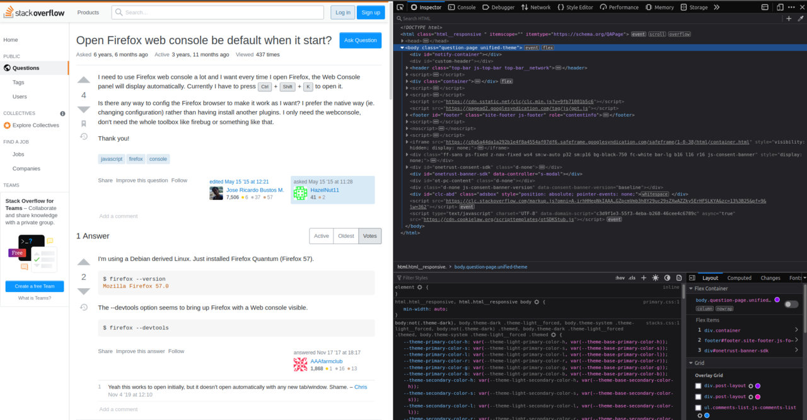

# Веб уязвимости 1

## Описание

Веб уязвимости - уязвимости веб-приложений. Веб-приложение - клиент-серверное приложение, в котором клиент 
взаимодействует с веб-сервером. Логика веб-приложения распределена между сервером и клиентом, хранение данных 
осуществляется, преимущественно, на сервере, обмен информацией происходит по сети. Клиент часто может являться
браузерным (работает в браузере).

## Анализ

Для того чтобы понять, какие уязвимости содержит веб-приложение, необходимо провести его анализ. Начать анализ
можно с изучения логики приложения. Логическая ошибка иногда является уязвимостью. 

### Инструменты браузера

Если клиент браузерный, то для проведения исследования доступны встроенные инструменты разработчика. Например, так 
выглядят инструменты разработчика в mozilla firefox (открываются по F12 или выбором пункта inspect в контекстном меню):

Во вкладке inspector (elements в chrome) можно видеть html код текущей страницы. Если хотим увидеть все файлы исходного 
приложения используемые на текущий момент, то нужно перейти во вкладку debugger (sources в chrome):

Открыт файл библиотеки jquery, где видим 
[минифицированный](https://www.wallarm.com/what/what-is-minification-and-why-is-it-needed) js код. Также полезной бывает
вкладка network: 

Во вкладке отображаются запросы, которые клиент посылает серверу, а также ответы. Есть возможность отфильтровать 
запросы по видам (HTML, CSS, JS, XHR, ...). Выделим один из запросов мышкой:

Видим заголовки запросов. При анализе работы приложения заголовки также могут быть полезны. В них может содержаться
информация о сервере, cookie, другая информация, передаваемая приложением (например, в кастомных заголовках). 

### Поиск скрытых файлов

Помимо анализа с помощью инструментов браузера существует много других различных способов. Найти скрытые файлы или 
директории на сервере можно с помощью утилит [dirsearch](https://github.com/maurosoria/dirsearch) и 
[dirbuster](https://github.com/KajanM/DirBuster). Бывают полезными файлы `robots.txt` и `sitemap.xml`, в них содержится
описание для роботов-поисковиков, какие файлы нужно индексировать, а какие нет. Например, сюда могут поместить путь до
панели администратора сайта.

### Fuzzing

Если сервер принимает какие-либо данные на вход, то можно пробовать передать данные неправильного формата, неожидаемые
сервером. Пусть есть сервер, написанный на языке python, который для генерации html страниц использует движок шаблонов
[jinja](https://jinja.palletsprojects.com/en/3.0.x/). Также пусть сервер возвращает форму регистрации нового 
пользователя:

Движок Jinja имеет возможность вставлять python код в шаблон с помощью фигурных скобок. Вставим код умножения чисел в 
поле имени:

Получив ответ от сервера, увидим следующее: `user 25 is registered`. Введя вместо имени данные другого формата, мы
получили инъекцию в шаблон. Такая атака называется SSTI.

В случае если клиент не позволяет вводить данные некорректного формата, можно делать запросы к серверу напрямую 
с помощью программы на любом языке или [postman](https://www.postman.com/). Пример запроса в postman:

Нестандартное поведение приложения могут вызвать любые неожидаемые данные (в том числе символы `,#@';%$№*!"-+=...`  и 
т.п.). 

## Уязвимости

Рассмотрим основные виды веб-уязвимостей.

### Инъекции

[Видеолекция](https://ulearn.me/course/hackerdom/283ec4e7-203e-42b5-8227-a887e307b51a) по инъекциям.

### SSRF

Пусть есть 2 сервера, один из которых внешний, другой внутренний. Сервера находятся в локальной сети. Пусть у внешнего 
сервера IP адрес в локальной сети `192.168.217.10`, а у внутреннего `192.168.217.11`.  

Внешний сервер может принимать на вход URL, делать запрос по этому URL и возвращать ответ:

К внешнему серверу запросы можно делать как изнутри сети, так и снаружи, к внутреннему - только изнутри локальной сети.
Кажется, что к внутреннему сервису доступа нет, но на самом деле мы можем получить доступ, проведя SSRF 
(Server-Side Request Forgery) атаку. Cуть атаки в том, чтобы передать в URL внешнему серверу адрес внутреннего сервера:

### Path traversal

Path traversal - атака, позволяющая получить доступ к скрытым файлам и директориям, используя нестандартные пути 
(например обращение к директории выше по иерархии `../` или абсолютный путь). Пусть файл `index.html`, возвращаемый 
сервером, лежит в директории `static`. Рядом с директорией `static` расположена директория `root`, в которой лежит файл 
`flag.txt`. Тогда мы можем получить доступ к `flag.txt` по URL `http://server/../root/flag.txt`. Если на сервере есть 
защита, проверяющая вхождение в путь подстроки, то ее можно обойти используя URL encoding.

## Полезные ссылки

  * Лекции
    * [Инъекции](https://ulearn.me/course/hackerdom/283ec4e7-203e-42b5-8227-a887e307b51a) - видеолекция от Хакердома
    * [Black-box в вебе](https://www.youtube.com/watch?v=5lf9W1whTbs) - видеолекция от SpbCTF
    * [PwnFunction](https://www.youtube.com/c/PwnFunction/videos) - youtube канал с разбором популярных веб-уязвимостей
  * Утилиты
    * [PayloadAllThings](https://github.com/swisskyrepo/PayloadsAllTheThings) -  репозиторий с наиболее популярными 
входными данными (payload’ами) для различных видов атак. Не всегда есть нужная нагрузка (payload), но отталкиваться 
стоит от этого.
    * [dirsearch](https://github.com/maurosoria/dirsearch) и [dirbuster](https://github.com/KajanM/DirBuster) - поиск
скрытых файлов и директорий
    * [Burp Suite](https://portswigger.net/burp) - прокси-сервер с возможностью подменять запросы клиента и ответы 
сервера
  * Порешать
    * [XSS Game](https://xss-game.appspot.com/) - игра на xss инъекции
    * [Natas](https://overthewire.org/wargames/natas/) - таски web